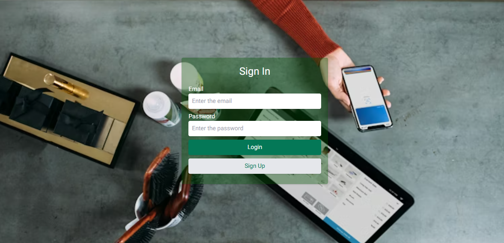
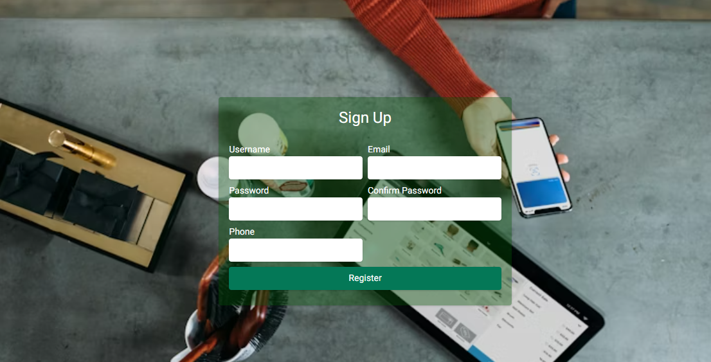
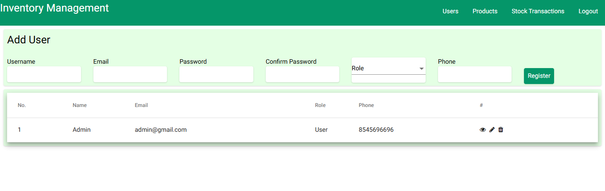
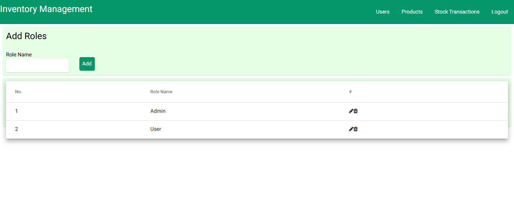
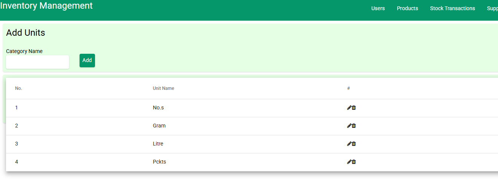
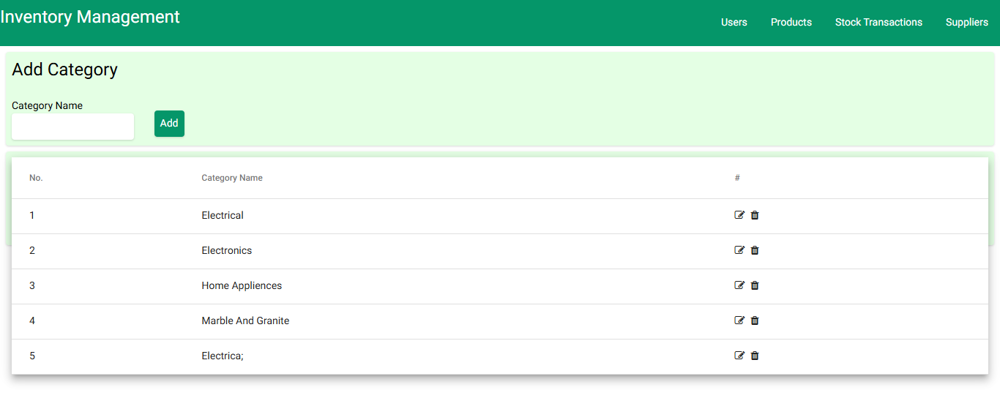
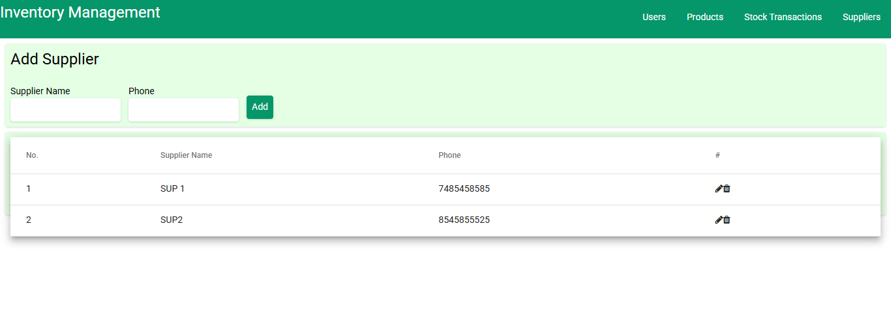
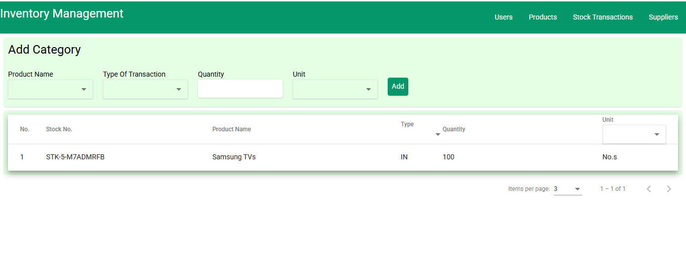

📦 Inventory Management System

A full-stack inventory management application built with Angular and Laravel REST API to manage products, suppliers, stock, and reports.

🔗 Live Demo

Frontend: https://rumsiya.github.io/inventory-management/

Backend API: https://inventory-management-api-production-edc5.up.railway.app/

🔐 Demo Login
Email: admin@gmail.com
Password: admin123

⚠️ Use demo credentials only.

🛠 Tech Stack
Frontend

Angular 12

TypeScript

Tailwind

Chart.js

Backend

Laravel (REST API)

PHP

MySQL

JWT Authentication

Cloudinary (Image Upload)

Deployment

Frontend: GitHub Pages

Backend: Railway

✨ Features

User authentication & authorization

Product, category, supplier CRUD

Stock in / stock out management

Monthly stock reports with charts

Image upload using Cloudinary

RESTful API with validation

Responsive UI

📸 Screenshots

(Add screenshots here — dashboard, product list, reports)

⚙️ Installation & Setup
Backend (Laravel)
git clone https://github.com/your-username/inventory-management-api.git
cd inventory-management-api
composer install
cp .env.example .env
php artisan key:generate
php artisan migrate
php artisan serve

Frontend (Angular)
git clone https://github.com/your-username/inventory-management.git
cd inventory-management
npm install
ng serve

Navigate to: http://localhost:4200/

🚀 Future Improvements

Add unit & integration tests

Role-based permissions

Export reports (PDF / Excel)

Improve UI performance

Dockerize backend

👤 Author

Rumsy
Full-Stack Developer (Angular | Laravel)
